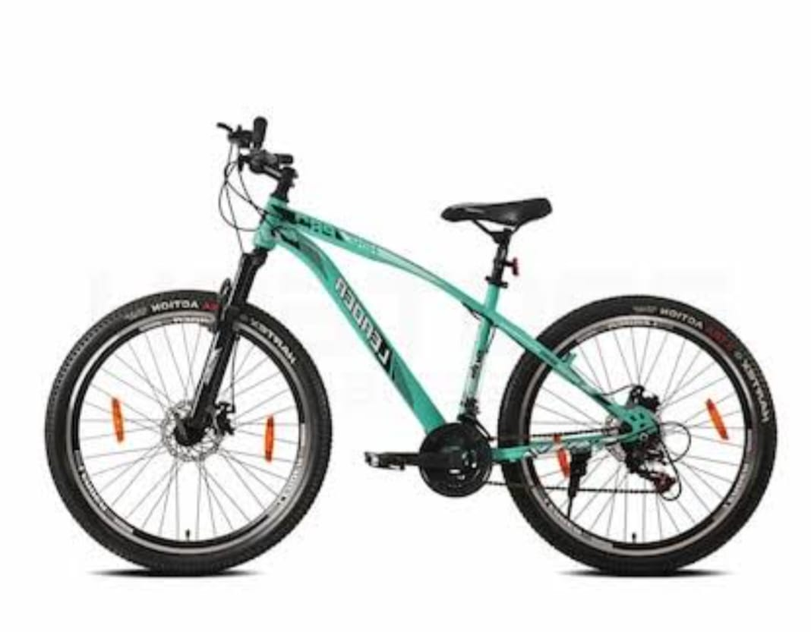

<!DOCTYPE html>
<html>
<head>
<title>S.B.CYCLE</title>

</head>
<body>

 <a href="#" class="active">Home</a>
 <a href="Gearless.html">NORMAL CYCLE</a>
 <a href="mtb.html">MTB CYCLE</a>
 <a href="Geared.html">GEAR CYCLE</a>
 <a href="cyimage.html">Images </a>

<h1 style="align-items: center">Welcome to S.B.CYCLE </h1>
<H2>Abouts S.B Cycles</H2>
 

    
We, S.B Cycles, are the largest cycle manufacturer in India and a trusted choice of cycling enthusiasts who thrive on counting on their every ride. It has been our greatest pleasure to serve the most cost-effective, convenient, and sustainable mobility solutions across the country. Catering to diverse needs, categories, and preferences, we offer an exclusive range of bicycles for men, women, and kids that are meticulously designed considering the latest trends, innovations, and advancements. Our dedication and commitment to top-quality, unbeatable performance, and unique style ensure that your every ride is safe and secure with S.B Cycles.
    We have something for everyone, whether you are commuting, running errands, hiking, or taking short trips to long and arduous trips, our collection will inspire you, giving you all the thrills and chills you could ever want.Every bike at S.B Cycles is a masterpiece in itself and a blend of creativity, innovation, and functionality.Our cycles' superior frame material, highly functional suspension, brakes, gear systems, and versatile tyres and wheels have set the standard in the cycling industry.From comfort and convenience to providing excellent traction and stability when you hike steep slopes, mountains, and snowy and sandy paths, S.B Cycles' new model cycle collection of the best MTB bikes, hybrid cycles, geared cycles, city bikes, and electric cycles is what works as the best companion for you. Even our top-notch electric bike collection fulfills the urge for sustainability in this constantly rising industry.
    

 
<h2 style="margin-top: 4cm;">GEAR CYCLEs</h2>

 

    

     A cycle with gears lets you choose the gear ratio depending on the terrain you are riding on. For instance, if you are riding on a slope, a lower gear ratio lets you ride uphill easily by increasing your pedaling rate while decreasing your effort.
    

 
  
 <h2 style="margin-top: 4cm;">MTB CYCLEs</h2>
 
 

    
A mountain bike (MTB) or mountain bicycle is a bicycle designed for off-road cycling. Mountain bikes share some similarities with other bicycles, but incorporate features designed to enhance durability and performance in rough terrain, which makes them heavier, more complex and less efficient on smooth surfaces.

 

 <html>
    <head>
        <title>S.B.CYCLE</title>
            

                

                    

                    
            

            

        

    </head>

    
            <body>
                <header>
                    <h1>S.B.CYCLE</h1>
                </header>
                <nav>
                    <a href="#">About</a>
                    <a href="#">Careers With Us</a>
                    <a href="#">Terms & Conditions</a>
                    <a href="#">Privacy Policy</a>
                    <a href="#">Corporate Policies</a>
                    <a href="#">Investors</a>
                    <a href="#">FAQS</a>
                </nav>
                <main>
                    <h2 >Connect With Us</h2>
                    <form style="padding: 30px;border-radius: 25px;background-color: darkkhaki; ">
                        <label for="name">Name:</label> 
                        <input type="text" id="name" name="name"> 
                        <label for="email">Email:</label> 
                        <input type="email" id="email" name="email"> 
                        <label for="message">Message:</label> 
                        <textarea id="message" name="message"></textarea> 
                        <input type="submit" value="Submit">
                    </form>
                    <h2>Others</h2>
                    <a href="#">Tyre</a> 
                    <a href="#">Vision</a> 
                    <a href="#">Emergency Response</a> 
                    <a href="#">CYCLE Sales Trends</a> 
                </main>
                <footer>
                    &copy;S.B.CYCLE
                </footer>
            </body>
</html>          
